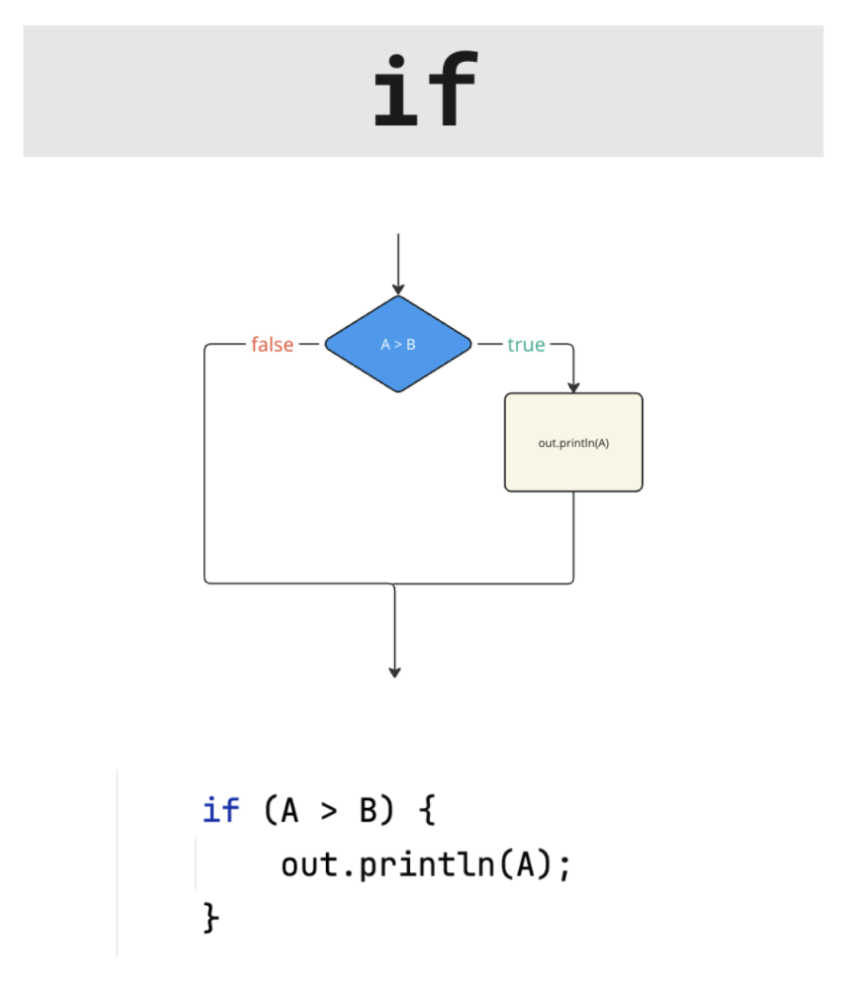
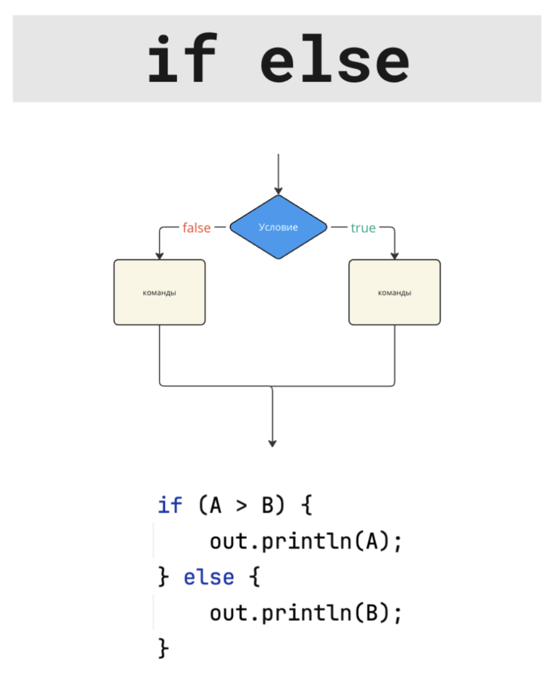
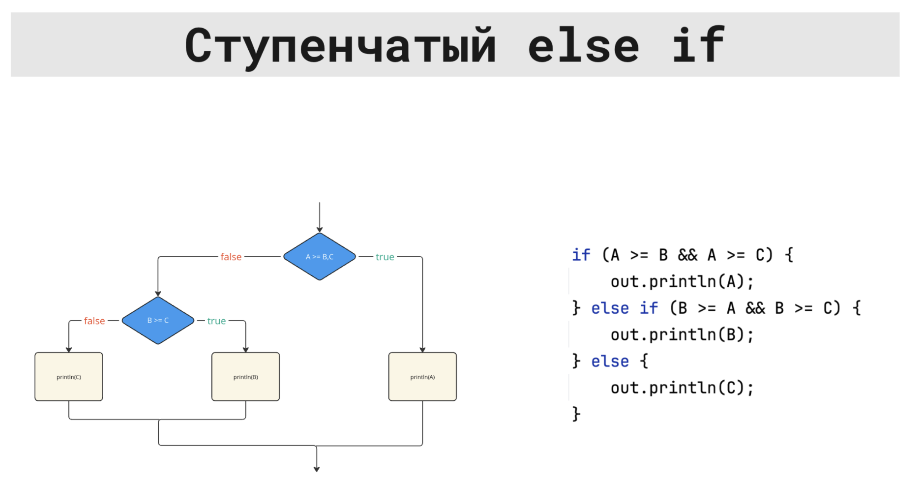

# Условия (if)

Во многих задачах нужно действовать по-разному в зависимости от условия:  
если число положительное – написать одно, если отрицательное – другое, если ноль – третье.

=== "Java"


    Для этого в Java есть оператор `if`. Он проверяет логическое выражение (да/нет) и в зависимости от результата выполняет нужный блок кода.

    ```java
    int x = in.nextInt();

    if (x > 0) {
        System.out.println("Положительное");
    } else if (x < 0) {
        System.out.println("Отрицательное");
    } else {
        System.out.println("Ноль");
    }
    ```

    ## Краткая сводка

    Условие в Java всегда основано на значении типа `boolean` — `true` или `false`.

    Основные формы записи:

    ```java
    if (условие) {
        // код, если условие истинно
    }
    ```

    ```java
    if (условие) {
        // если истинно
    } else {
        // если ложно
    }
    ```

    ```java
    if (условие1) {
        // вариант 1
    } else if (условие2) {
        // вариант 2
    } else {
        // все остальные случаи
    }
    ```

    Чаще всего условия строятся из сравнений (`==`, `!=`, `<`, `>`, `<=`, `>=`) и логических операций (`&&`, `||`, `!`).

    ---

    ## Простое условие: if

    Самый простой вариант — выполнить блок кода только когда условие истинно.

    ```java
    int age = in.nextInt();

    if (age >= 18) {
        System.out.println("Взрослый");
    }

    System.out.println("Конец программы");
    ```

    Если `age >= 18` истинно, будет выведено два сообщения.  
    Если ложно — только `"Конец программы"`.

    ---

    ## Два варианта: if … else

    Когда нужно выбрать между двумя вариантами, используется `if … else`:

    ```java
    int x = in.nextInt();

    if (x % 2 == 0) {
        System.out.println("Чётное");
    } else {
        System.out.println("Нечётное");
    }
    ```

    Здесь всегда выполняется ровно один из блоков: либо после `if`, либо после `else`.

    ---

    ## Несколько вариантов: цепочка if … else if … else

    Если вариантов больше двух, можно сделать цепочку условий:

    ```java
    int x = in.nextInt();

    if (x > 0) {
        System.out.println("Положительное");
    } else if (x < 0) {
        System.out.println("Отрицательное");
    } else {
        System.out.println("Ноль");
    }
    ```

    Блоки проверяются сверху вниз:

    - сначала проверяется первое условие;
    - если оно ложно, проверяется следующее `else if`;
    - если все условия ложны, выполняется блок `else` (если он есть).

    ---

    ## Диапазоны и составные условия

    Частая задача — проверить, попадает ли число в некоторый диапазон.

    ```java
    int x = in.nextInt();

    if (x >= 1 && x <= 100) {
        System.out.println("В диапазоне 1..100");
    } else {
        System.out.println("Вне диапазона");
    }
    ```

    Здесь используется логическое И (`&&`): оба условия `x >= 1` и `x <= 100` должны быть истинны.

    Другой пример — один из нескольких вариантов:

    ```java
    int month = in.nextInt();

    if (month == 12 || month == 1 || month == 2) {
        System.out.println("Зима");
    }
    ```

    Здесь логическое ИЛИ (`||`): достаточно, чтобы истинным было хотя бы одно из сравнений.

    ---

    ## Вложенные условия

    Иногда удобно писать условия внутри условий:

    ```java
    int x = in.nextInt();

    if (x >= 0) {
        if (x % 2 == 0) {
            System.out.println("Неотрицательное чётное");
        } else {
            System.out.println("Неотрицательное нечётное");
        }
    } else {
        System.out.println("Отрицательное");
    }
    ```

    Такие конструкции нужно писать аккуратно и не усложнять без необходимости.  
    Часто вложенные `if` можно заменить на одну цепочку `if … else if … else`.

    ---

    ## Типичные шаблоны

    **Максимум из двух чисел**

    ```java
    int a = in.nextInt();
    int b = in.nextInt();

    int max;

    if (a >= b) {
        max = a;
    } else {
        max = b;
    }

    System.out.println(max);
    ```

    **Классический «знак числа»**

    ```java
    int x = in.nextInt();

    if (x > 0) {
        System.out.println(1);
    } else if (x < 0) {
        System.out.println(-1);
    } else {
        System.out.println(0);
    }
    ```

    **Проверка корректности значения**

    ```java
    int score = in.nextInt();

    if (score < 0 || score > 100) {
        System.out.println("Некорректное значение");
    } else {
        System.out.println("ОК");
    }
    ```

    ## Блок-схемы

    { width="50%" }
    { width="50%" }
    
    
    

    ## Что нужно запомнить

    Условие в `if` — это логическое выражение (`boolean`), которое даёт `true` или `false`.

    Основные формы: одиночный `if`, пара `if … else` и цепочка `if … else if … else`.

    Сложные условия удобно строить из сравнений и логических операций: диапазоны — через `&&`, варианты «или то, или это» — через `||`.

=== "C++"

    В C++ оператор `if` выбирает, какой блок кода выполнить, в зависимости от условия.

    Условие обычно пишут как сравнение (`x > 0`, `a == b`) или как логическое выражение с `&&`, `||`, `!`.

    **Минимум, который нужен в задачах**

    `if (условие) { ... }` – выполнить блок, если условие истинно.

    `if (условие) { ... } else { ... }` – выбрать один из двух вариантов.

    `if (...) { ... } else if (...) { ... } else { ... }` – выбрать один из нескольких вариантов.

    В C++ условием может быть не только `bool`, но и целое число: `0` считается ложью, любое ненулевое – истиной. На практике лучше писать явные сравнения.

    **Пример: знак числа**

    ```cpp
    #include <iostream>
    using namespace std;

    int main() {
        int x;
        cin >> x;

        if (x > 0) {
            cout << "Положительное\n";
        } else if (x < 0) {
            cout << "Отрицательное\n";
        } else {
            cout << "Ноль\n";
        }
    }
    ```

    **Пример: чётное или нечётное**

    ```cpp
    #include <iostream>
    using namespace std;

    int main() {
        int x;
        cin >> x;

        if (x % 2 == 0) {
            cout << "Чётное\n";
        } else {
            cout << "Нечётное\n";
        }
    }
    ```

    **Пример: диапазон**

    ```cpp
    #include <iostream>
    using namespace std;

    int main() {
        int x;
        cin >> x;

        if (x >= 1 && x <= 100) {
            cout << "В диапазоне 1..100\n";
        } else {
            cout << "Вне диапазона\n";
        }
    }
    ```

=== "Python"

    В Python оператор `if` выбирает, какой блок кода выполнить, в зависимости от условия.

    Условия обычно пишут как сравнение (`x > 0`, `a == b`) или как логическое выражение с `and`, `or`, `not`.

    **Минимум, который нужен в задачах**

    `if условие:` – выполнить блок, если условие истинно.

    `if ...: ... else: ...` – выбрать один из двух вариантов.

    `if ...: ... elif ...: ... else: ...` – выбрать один из нескольких вариантов.

    В Python важно, что блоки кода задаются отступами.

    **Пример: знак числа**

    ```python
    x = int(input())

    if x > 0:
        print("Положительное")
    elif x < 0:
        print("Отрицательное")
    else:
        print("Ноль")
    ```

    **Пример: чётное или нечётное**

    ```python
    x = int(input())

    if x % 2 == 0:
        print("Чётное")
    else:
        print("Нечётное")
    ```

    **Пример: диапазон**

    ```python
    x = int(input())

    if 1 <= x <= 100:
        print("В диапазоне 1..100")
    else:
        print("Вне диапазона")
    ```

=== "Отличия"

    **Что можно писать в условии**

    В Java в `if (...)` должно быть строго `boolean`.

    В C++ в условии можно написать и `bool`, и число: `0` – ложь, ненулевое – истина.

    В Python можно писать `True/False`, сравнения, а также использовать «истинность» значений (например, `0` считается ложью). В задачах обычно удобнее писать сравнения.

    **Как выглядит блок кода**

    В Java и C++ блоки задаются фигурными скобками `{ ... }`.

    В Python блоки задаются отступами.

    **Ключевые слова**

    Java: `if`, `else if`, `else`.

    C++: `if`, `else if`, `else`.

    Python: `if`, `elif`, `else`.

    **Логические операции**

    Java и C++: `&&`, `||`, `!`.

    Python: `and`, `or`, `not`.

    **Частая ошибка в C++**

    В условии легко перепутать `==` (сравнение) и `=` (присваивание). В `if` нужно сравнение.
